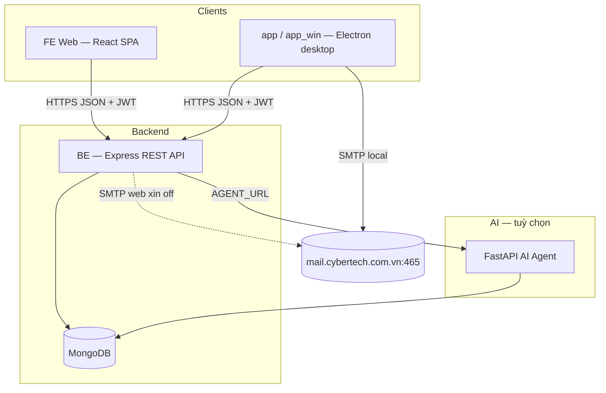

## TaskMate - Hệ thống quản lý công việc (AI + BE + FE) by LongPIP

TaskMate là một ứng dụng quản lý công việc/dự án với kiến trúc tách ba phần:

- **FE**: Frontend React + Vite + Tailwind, cung cấp giao diện web cho người dùng.
- **BE**: Backend Node.js/Express + MongoDB, cung cấp REST API cho auth, users, projects, tasks, profile và tích hợp AI.
- **AI**: FastAPI service cho TaskMate AI Agent, đọc dữ liệu từ MongoDB và xử lý hội thoại thông minh.

---

## Cấu trúc thư mục chính

- **`FE/`**: Frontend React
  - `src/app` – layout, routes, shell ứng dụng.
  - `src/features/auth` – đăng nhập, quản lý phiên.
  - `src/features/tasks`, `projects`, `users`, `time-off`, `notifications`, `dashboard`, `automation`, `profile`, `bug-reports` – trang nghiệp vụ chính.
  - `src/features/ai/components/ai-chat-widget.tsx` – UI chat với AI agent.
  - `src/shared/api` – client HTTP, mock-client, mock-data, types chia sẻ.
  - `.env.example` – cấu hình `VITE_API_URL` tới BE.

- **`BE/`**: Backend API
  - `src/app.js` – khởi tạo Express app, cấu hình CORS, JSON, static, mount routes.
  - Các routes chính:
    - `/api/auth` – xác thực, đăng nhập.
    - `/api/projects` – CRUD dự án.
    - `/api/tasks` – CRUD task.
    - `/api/users` – quản lý người dùng.
    - `/api/profile` – hồ sơ cá nhân.
    - `/api/notifications`, `/api/time-off`, `/api/bug-reports`, `/api/birthdays` – thông báo, xin off, bug, sinh nhật.
    - `/api/ai` – endpoint nói chuyện với AI agent (nếu bật).
  - `src/routes/aiRoutes.js` – route `/api/ai/chat` bảo vệ bằng `authMiddleware`.
  - `src/controllers/aiController.js` – controller gọi sang AI service qua `AGENT_URL`.
  - `data/` – dữ liệu mẫu (ví dụ `users.json`) cho seeding.
  - `package.json` – scripts `dev`, `start`, `seed`.

- **`AI/`**: AI Agent Service
  - `service.py` – FastAPI app:
    - Khởi tạo app `TaskMate AI Agent`.
    - `@app.on_event("startup")` gọi `config.load_data_from_mongo()` để load dữ liệu ban đầu.
    - Endpoint `POST /chat` nhận `message`, build state cho agent graph, trả về `reply` + `meta`.
  - `requirements.txt` – danh sách dependencies (FastAPI, uvicorn, langgraph, langchain-openai, rapidfuzz, pymongo, ...).
  - Các module khác (ví dụ `config.py`, `agent.py`, ...) định nghĩa kết nối MongoDB và graph của AI agent.

---

## Luồng hoạt động tổng quan

1. **Người dùng thao tác trên FE**
   - FE gọi **BE** qua `VITE_API_URL` (ví dụ `http://localhost:6969`) để đăng nhập, lấy dữ liệu projects/tasks/users, cập nhật profile, v.v.
2. **Quản trị viên sử dụng AI Assistant**
   - Ở giao diện admin, widget chat AI (`ai-chat-widget`) gửi request lên **BE** endpoint `/api/ai/chat`.
   - BE kiểm tra `req.user.role` (chỉ cho phép `ADMIN`) rồi forward `message` sang **AI** service tại `AGENT_URL` (mặc định `http://127.0.0.1:8000/chat`).
3. **AI Agent xử lý**
   - AI service đọc dữ liệu mới nhất từ MongoDB (`config.load_data_from_mongo()`), build state ban đầu từ câu hỏi, chạy `graph.invoke(...)` để tạo câu trả lời.
   - Trả về JSON `{ reply, meta }` cho BE, sau đó FE hiển thị message AI cho admin.

---

## Cách chạy từng phần

### 1. Chạy Backend (`BE`)

**Yêu cầu**:
- Node.js (phiên bản LTS mới).
- MongoDB đang chạy (local hoặc remote), cấu hình trong `.env` của BE.

**Các bước**:

```bash
cd BE
npm install

# Tạo file .env dựa trên .env.example
# (điền thông tin MongoDB URI, JWT_SECRET, PORT, ...)

# (tuỳ chọn) seed dữ liệu mẫu
npm run seed

# Chạy server
npm run dev
# hoặc
npm start
```

BE sẽ lắng nghe tại port được cấu hình trong `.env` (ví dụ `6969`), có endpoint `/health` để kiểm tra kết nối DB.

---

### 2. Chạy AI Agent (`AI`)

**Yêu cầu**:
- Python 3.11+.
- MongoDB (trùng database với BE, config trong `config.py` hoặc biến môi trường).

**Các bước**:

```bash
cd AI
python -m venv .venv
source .venv/bin/activate  # macOS/Linux
# hoặc .venv\Scripts\activate  # Windows

pip install -r requirements.txt

# Chạy service
export AGENT_PORT=8000  # nếu muốn đổi port
uvicorn service:app --host 0.0.0.0 --port ${AGENT_PORT:-8000} --reload
```

AI service phải chạy thành công để BE có thể gọi được endpoint `/chat`. BE dùng biến môi trường `AGENT_URL` (mặc định `http://127.0.0.1:8000/chat`).

---

### 3. Chạy Frontend (`FE`)

**Yêu cầu**:
- Node.js (phiên bản hỗ trợ Vite, React 19).

**Các bước**:

```bash
cd FE
npm install

# Tạo file .env từ .env.example
cp .env.example .env
# Đảm bảo VITE_API_URL trỏ đúng về BE, ví dụ:
# VITE_API_URL=http://localhost:6969

npm run dev
```

FE sẽ chạy bằng Vite (mặc định `http://localhost:5173`), giao tiếp với BE thông qua `VITE_API_URL`.

---

## Ghi chú cấu hình & môi trường

- **Đồng bộ PORT**:
  - `VITE_API_URL` trong `FE/.env` phải trùng với `PORT` cấu hình trong `.env` của `BE`.
  - `AGENT_URL` trong `.env` của `BE` phải trỏ tới `AI` service, ví dụ `http://127.0.0.1:8000/chat`.

- **Quyền truy cập AI**:
  - Chỉ user có `role = "ADMIN"` mới được gọi API `/api/ai/chat`. Nếu không, BE trả về lỗi 403.

- **Dữ liệu MongoDB**:
  - AI service luôn reload dữ liệu từ Mongo trước mỗi lần chat để đồng bộ với BE, đảm bảo AI hiểu đúng trạng thái tasks/projects/users mới nhất.

---

## Kiến trúc hệ thống

TaskMate là **hệ thống client–server** gồm nhiều thành phần độc lập, giao tiếp qua HTTP/REST:



| Thành phần | Vai trò | Deploy / chạy |
|------------|---------|----------------|
| **FE** | Giao diện web (task, project, user, xin off, profile, …) | Vite dev / build static → Vercel |
| **BE** | REST API, auth, nghiệp vụ, upload, mail (web), scheduler | Node.js → Render |
| **AI** | Chat agent đọc MongoDB, trả lời admin | Python FastAPI (local hoặc host riêng) |
| **app / app_win** | Desktop xin off — gửi mail SMTP từ máy user, sync BE (`skipMail`) | Electron `.dmg` / `.exe` |

**Luồng dữ liệu chính:** Browser/Electron → `Authorization: Bearer <JWT>` → BE → Mongoose → MongoDB. Desktop gửi mail **trực tiếp** tới SMTP server, không bắt buộc qua BE.

---

## Frontend (`FE`)

### Ngôn ngữ & runtime

| | |
|---|---|
| **Ngôn ngữ** | TypeScript |
| **Markup / style** | TSX, CSS (Tailwind) |
| **Runtime** | Browser (SPA) |

### Framework & công cụ build

| | Phiên bản / ghi chú |
|---|---|
| **UI framework** | React 19 |
| **Bundler / dev server** | Vite 7 |
| **Routing** | React Router 7 |
| **Type check** | TypeScript 5.9 |

### Thư viện chính

| Nhóm | Thư viện | Mục đích |
|------|----------|----------|
| **Data fetching** | TanStack React Query | Cache API, mutation, invalidate |
| **Validation** | Zod | Schema form (login, task, …) |
| **Styling** | Tailwind CSS 4, `@tailwindcss/vite`, `tailwindcss-animate` | Utility-first CSS |
| **UI components** | Radix UI, shadcn-style (`components/ui/`) | Button, Input, Label, Card, … |
| **Icons** | lucide-react | Icon set |
| **Utils CSS** | `clsx`, `tailwind-merge`, `class-variance-authority` | Gộp className |
| **Export** | xlsx | Xuất Excel (xin off, …) |

### Kiến trúc tổ chức code (feature-based)

FE tổ chức theo **vertical slices** — mỗi domain nghiệp vụ nằm trong `features/`, tách khỏi shell ứng dụng:

```
FE/src/
├── app/                    # Shell: routes, layout, nav, protected/admin route
│   ├── routes.tsx
│   ├── layouts/
│   ├── components/         # AppHeader, Sidebar, FAB, …
│   ├── config/             # nav-items, home path theo role
│   └── providers/          # React Query provider
├── features/               # Module theo nghiệp vụ
│   ├── auth/               # login, use-auth, auth-store
│   ├── tasks/              # pages, hooks, schemas, drawers
│   ├── projects/
│   ├── users/
│   ├── time-off/
│   ├── notifications/
│   ├── profile/
│   ├── dashboard/
│   ├── automation/
│   └── bug-reports/
├── shared/                 # Dùng chung toàn app
│   ├── api/                # client.ts, mock-client, types
│   ├── components/
│   ├── hooks/
│   ├── lib/
│   └── types/
└── components/ui/          # Design system (shadcn)
```

**Quy ước:**

- **`app/`** — khung app, routing, layout; không chứa logic nghiệp vụ sâu.
- **`features/<domain>/`** — `pages/`, `components/`, `hooks/`, `schemas/` của từng domain.
- **`shared/api`** — một lớp HTTP (`client.ts`); có `mock-client` để dev không cần BE.
- **Auth** — JWT lưu `localStorage` (`taskmate_token`), gửi header `Bearer` mỗi request.

**Pattern:** SPA + protected routes + server state (React Query) + form validation (Zod).

---

## Backend (`BE`)

### Ngôn ngữ & runtime

| | |
|---|---|
| **Ngôn ngữ** | JavaScript (ES modules, `"type": "module"`) |
| **Runtime** | Node.js |
| **Database** | MongoDB (driver `mongodb` + ODM Mongoose) |

### Framework & middleware

| | Ghi chú |
|---|---|
| **HTTP framework** | Express 4 |
| **CORS** | `cors` — cấu hình trong `config/cors.js` |
| **Env** | `dotenv` — load `.env` tại `server.js` |
| **Validation** | `express-validator` — middleware `validate.js` |
| **Auth** | `jsonwebtoken` (HS256) + `bcrypt` (password user) |
| **Upload** | `multer` — avatar (`config/upload.js`) |
| **Email** | `nodemailer` — SMTP xin off trên web (`services/mailService.js`) |

### Kiến trúc tổ chức code (MVC + services)

BE theo **layered MVC** rõ ràng:

```
BE/src/
├── server.js               # Entry: connect DB, listen port, scheduler
├── app.js                  # Express app, mount routes, error handler
├── config/                 # database, cors, upload
├── routes/                 # Định tuyến HTTP → controller (+ middleware)
├── middleware/             # auth (JWT), rbac, validate, errorHandler
├── controllers/            # Xử lý request/response, gọi model & service
├── models/                 # Mongoose schema (User, Task, Project, …)
├── services/               # Logic tái sử dụng (mail, automation scheduler)
└── utils/                  # Helper thuần (errors, format user, mail crypto, …)
```

**Luồng một request:**

```
Route → authMiddleware → requireRole (tuỳ route) → validate → Controller → Model/Service → JSON response
                                                                    ↓
                                                          errorHandler (global)
```

**API REST** dưới prefix `/api/*`:

| Prefix | Chức năng |
|--------|-----------|
| `/api/auth` | Login, JWT |
| `/api/projects`, `/api/tasks` | CRUD dự án & task |
| `/api/users`, `/api/profile` | User admin & hồ sơ cá nhân |
| `/api/notifications` | Thông báo in-app |
| `/api/time-off` | Xin nghỉ / duyệt |
| `/api/bug-reports`, `/api/birthdays` | Bug report, sinh nhật |

**Auth & phân quyền:**

- JWT access token (một token, `JWT_SECRET`, expire `JWT_EXPIRES`).
- `authMiddleware` gắn `req.user`; `requireRole("ADMIN")` cho route admin.
- Mật khẩu webmail (web) mã hóa AES-256-GCM (`MAIL_CREDENTIALS_KEY`), không trả về client.

**Background:** `automationService` — scheduler kiểm tra deadline task (chạy cùng process BE).

---

## AI (`AI`) — tóm tắt

| | |
|---|---|
| **Ngôn ngữ** | Python 3.11+ |
| **Framework** | FastAPI + Uvicorn |
| **Thư viện** | LangGraph, LangChain OpenAI, RapidFuzz, PyMongo |
| **Vai trò** | BE proxy `/api/ai/chat` → `AGENT_URL`; chỉ `ADMIN` |

---

## Desktop (`app` / `app_win`) — tóm tắt

| | |
|---|---|
| **Stack** | Electron + React + Vite + TypeScript |
| **Mail** | `nodemailer` trong `main.cjs`; credential `electron-store` + `safeStorage` (Keychain/DPAPI) |
| **Kiến trúc** | Main process (IPC, SMTP) + renderer (React UI) + preload (`contextBridge`) |

---

## Tech stack tóm tắt

| Layer | Stack |
|-------|--------|
| **FE** | TypeScript, React 19, Vite 7, React Router 7, TanStack Query, Tailwind 4, shadcn/Radix, Zod, xlsx |
| **BE** | Node.js, Express 4, Mongoose, MongoDB, JWT, bcrypt, express-validator, Multer, nodemailer |
| **AI** | Python, FastAPI, LangGraph, LangChain OpenAI, PyMongo |
| **Desktop** | Electron, React, Vite, nodemailer, electron-store |

README này mô tả tổng quan kiến trúc, tech stack và cách chạy các thành phần của project **TaskMate**.
