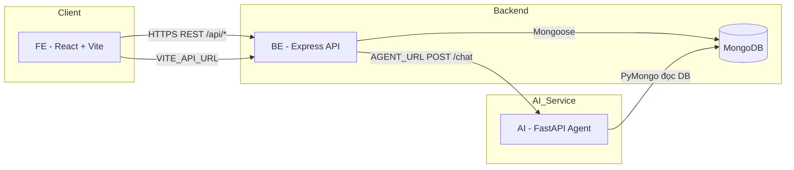

# 1. Sơ đồ tổng quan hệ thống — TaskMate

TaskMate gồm **3 service** chính: **FE** (React/Vite), **BE** (Express/MongoDB), **AI** (FastAPI/LangGraph/OpenAI). Người dùng chỉ tương tác với FE; BE cung cấp REST API; AI xử lý hội thoại thông minh và được BE gọi thay cho việc expose AI trực tiếp ra browser (trừ môi trường dev tùy cấu hình).

## 1.1. Sơ đồ thành phần (C4 đơn giản)



## 1.2. Luồng dữ liệu tóm tắt

| Luồng | Mô tả |
|--------|--------|
| **Auth & CRUD** | FE → `POST /api/auth/login` → nhận JWT → các request kèm `Authorization: Bearer` → BE truy vấn MongoDB. |
| **AI Assistant (Admin)** | FE → `POST /api/ai/chat` (JWT, role ADMIN) → BE forward body `{ message }` → AI `POST /chat` → trả `{ reply, meta }`. |
| **Đồng bộ dữ liệu AI** | AI gọi `load_data_from_mongo()` trước mỗi lần chat để đồng bộ tasks/projects/users với cùng DB như BE. |

## 1.3. Cấu trúc thư mục (rút gọn)

```
taskMate/
├── FE/          # React 19, Vite, TanStack Query, Tailwind
├── BE/          # Express, Mongoose, JWT, express-validator
├── AI/          # FastAPI, uvicorn, LangGraph, langchain-openai
└── notes/       # Tài liệu (folder này)
```

## 1.4. Biến môi trường chính (tham chiếu)

| Service | Biến quan trọng (không đưa secret vào Git) |
|---------|---------------------------------------------|
| **FE** | `VITE_API_URL` — base URL của BE |
| **BE** | `PORT`, `MONGODB_URI`, `DB_NAME`, `JWT_SECRET`, `AGENT_URL` |
| **AI** | `MONGODB_URI`, `DB_NAME`, `OPENAI_API_KEY`, `OPENAI_MODEL`, port qua `$PORT` / `AGENT_PORT` |

Chi tiết bảo mật: xem [04-security-best-practices.md](./04-security-best-practices.md).
