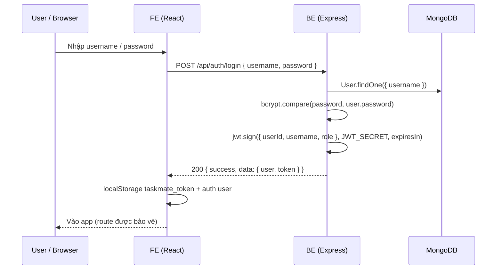

# 3. Authentication flow — TaskMate

Tài liệu dựa trên `BE/src/controllers/authController.js`, `BE/src/middleware/auth.js`, `BE/src/middleware/rbac.js`, `FE/src/shared/api/client.ts`, `FE/src/features/auth/`.

## 3.1. Tổng quan

- **Cơ chế:** JWT (JSON Web Token), ký bằng `JWT_SECRET` trên server.
- **Lưu trữ phía client:** token trong `localStorage` (`taskmate_token`), user profile trong `localStorage` (`taskmate_auth_user` — xem `auth-store.ts`).
- **Gửi request:** header `Authorization: Bearer <token>` (tự động trong `client.ts` khi gọi API thật).

## 3.2. Luồng đăng nhập (sequence)

## 3.3. Bảo vệ route API (BE)

1. **`authMiddleware`** (`auth.js`):
   - Yêu cầu header `Authorization: Bearer <token>`.
   - `jwt.verify(token, JWT_SECRET)` → lấy `userId`.
   - Load user từ DB; kiểm tra `disabled`.
   - Gán `req.user = { id, username, role, fullName }`.
   - Lỗi JWT → `401` với message `"Invalid or expired token"` / tương đương.

2. **`requireRole("ADMIN")`** (`rbac.js`):
   - Chạy sau khi đã có `req.user`.
   - Nếu `req.user.role` không thuộc danh sách → `403` Insufficient permissions.

## 3.4. Ánh xạ endpoint ↔ Auth (theo code hiện tại)

| Prefix / Route | authMiddleware | requireRole |
|----------------|----------------|-------------|
| `POST /api/auth/login` | Không | Không |
| `GET /health` | Không | Không |
| `/api/projects/*` | Có (router.use) | ADMIN |
| `/api/users/*` | Có | ADMIN |
| `GET /api/tasks`, `GET /api/tasks/:id` | Có | Không (mọi user đăng nhập) |
| `POST/PUT/DELETE /api/tasks` | Có | ADMIN (create/update/delete) |
| `/api/profile/*` | Có | Không |
| `POST /api/ai/chat` | Có | Trong controller: chỉ **ADMIN** (xem `aiController`) |

## 3.5. Luồng phía FE

1. **Login:** `login()` trong `shared/api` → `POST /api/auth/login` → lưu token + dispatch UI (hook `useAuth`).
2. **Request tiếp theo:** `request()` trong `client.ts` đọc token và gắn `Authorization`.
3. **Logout:** `clearToken()` + xóa user trong store (xem `use-auth` / `auth-store`).

## 3.6. Payload JWT (tham chiếu code)

Sign payload gồm: `userId`, `username`, `role` (xem `authController.js`). Thời hạn mặc định: `JWT_EXPIRES` (mặc định `1d` nếu không set env).

## 3.7. Ghi chú

- **AI service** (`/chat`) không dùng JWT trong code hiện tại — chỉ BE (đã xác thực user) được gọi. Không expose AI trực tiếp cho browser nếu không có thêm lớp bảo vệ.
